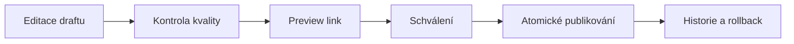

# Brandywine — produktový audit

Stav po revizi 21. srpna 2026. Dokument rozlišuje funkci přítomnou v datovém
modelu od workflow, které je skutečně dokončené pro koncového uživatele.

## Revize aplikace — 26. září 2026

### Opraveno při této revizi

- Výběr palety v bloku Barvy vychází ze skutečných palet a ukládá ID, takže
  přejmenování palety nerozbije výběr. Staré názvy zůstávají podporované;
  neexistující výběr už tiše nezobrazí všechny barvy. Stejná logika platí pro
  veřejný blok, Markdown export, náhled karty a obsahovou kontrolu.
- Úvodní stránka vykresluje i bloky s platným výchozím nastavením `{}` a
  respektuje vypnutí úvodní stránky.
- Obsahová kontrola rozpozná prázdná typografická pravidla, nepočítá skryté
  bloky do duplicitních veřejných kotev, dovolí samostatný kalkulátor kontrastu
  bez palety a nezaměňuje chybu kontroly za nulový počet problémů.
- Dashboard nabízí přímý vstup do manuálu; správu uživatelů nabízí pouze
  administrátorům. Skryté bloky a informační tipy nesnižují skóre kontroly.
- Opakované stejné textové odstavce již nekolidují v klíčích Svelte;
  identifikátory palet jsou unikátní i při více blocích barev na stránce.
- Opravená konfigurace E2E testů používá baseURL a skutečnou cestu `/`;
  testy kontrolují HTTP stav, viditelný obsah, přihlášení a skutečnou 404.

### Ověření revize

- Produkční build aplikace, lint a Svelte/TypeScript kontrola prošly; 0 chyb
  a 0 upozornění, 41 unit testů v 7 souborech.
- Izolovaná instance: `/`, `/logo`, `/barvy`, Markdown export a `llms.txt`
  vracejí 200, neexistující stránka 404 a `/admin` přesměruje na přihlášení.
  V prohlížeči ověřeno hledání a přechod na výsledek klávesnicí.
- Přihlášené zapisovací workflow administrace nebylo end-to-end provedeno;
  tato revize nepřepisovala uživatelský obsah v databázi.
- Produkční závislosti aplikace aktualizovány na Sharp 0.35.4, Nodemailer
  9.1.1 a devalue 5.9.4; `npm audit --omit=dev` po aktualizaci bez nálezů.
  Worker aktualizován na Sharp 0.35.4 a SVGO 3.3.5; kontrola typů, build
  i produkční audit prošly bez nálezů.
  Vývojové závislosti aplikace stále obsahují 12 hlášení (5 low, 7 moderate).
- Místní Git při některých čteních hlásil „packfile is far too short“.
  Historie ani objekty `.git` nebyly opravovány či odstraňovány; před další
  prací s historií je nutné došetřit integritu úložiště. Build a testy proběhly
  nad zdroji v odděleném Docker kontejneru.

### Obsah k redakčnímu dokončení

Pozorováno na lokální instanci při revizi; jde o obsah uložený v databázi,
nikoli o výchozí obsah repozitáře. Data nebyla automaticky přepsána.

- Stránka **Barvy** obsahuje zástupné „Text upozornění…“, tiskový grid,
  demonstrační graf a typografii. Rozdělit na Barvy, Grid a Typografii,
  pokud nejde o záměrnou testovací stránku.
- Na stránce **Logo** dokončit text „Mozog“, sjednotit „Logo -základní“ na
  „Základní logo“ a české/anglické označení variant.
- Typografický styl „test“ a dva různé styly H1 vyžadují rozhodnutí, který
  je schválený. Nic neodstraňovat bez znalosti zamýšlené hierarchie.
- Výrobní reference barev musí potvrdit vlastník značky; z HEX nelze
  automaticky garantovat správný Pantone ani tiskový výstup.

## Mapa produktu

| Oblast | Stav | Co je dnes použitelné | Co chybí k profesionálnímu release |
| --- | --- | --- | --- |
| Veřejný manuál | dobrý základ | hierarchie, navigace, témata, responzivní stránky, vyhledání stránky | draft/publish, historie, SEO, fulltext obsahu, PDF/offline export |
| Editor manuálu | částečně hotový | stránky, pořadí a široká sada bloků | reusable bloky, preview breakpointů, quality gate, undo/redo napříč relací |
| Dynamické bloky | funkční základ | galerie, carousel, ikony, asset galerie a download napojené na DAM složky/tagy | ruční kurátorství, limity/řazení, přístupné ovládání carouselu a renditions |
| Barvy | silný | palety, gradienty, odstíny, kontrast, výrobní reference | schvalování, token aliasy/themes a širší exporty |
| Typografie | silný | fonty, soubory, řezy, styly, glyphs, kontrast barev | licenční expirace, subsety, fallback stack validace a export tokenů |
| DAM | dobrý základ | upload, složky, tagy, náhledy, přesun, download, konverze, kontrola duplicit | verze, kolekce, lifecycle, share links, metadata, background ZIP a job status |
| Přístup a role | částečně hotový | admin/editor/member, session, magic link, veřejný a heslový manuál, e-mail whitelist | token share links, rate limiting, UI týmů a audit oprávnění |
| Lokalizace | základ infrastruktury | české/anglické systémové texty a výchozí jazyk | oddělený obsah podle jazyka, fallback, překladový workflow |
| Provoz | nasaditelný základ | produkční Compose, Caddy, dependency-aware readiness, migrace, worker a CLI pro install/doctor/backup/restore/update | podepsané verzované image, automatické off-site zálohy, rollback a provozní dashboard |
| Governance | chybí | dílčí role a strukturovaná data | audit log, komentáře, approval, ownership, revize a notifikace |
| Integrace | raný základ | token endpoint | scoped API tokens, webhooks, Figma/Token Studio, SSO/SCIM |

## Opravené problémy z revize

- všech 82 starších Svelte upozornění bylo odstraněno; dialogy mají keyboard
  focus trap, Escape a návrat focusu;
- hodnoty načítané ze serveru se po invalidaci synchronizují a nezůstávají ve
  starém snapshotu;
- upload/download přístup, duplicitní assety, video náhledy a úklid souborů
  používají konzistentní serverové kontroly;
- hromadné mazání a přesun už neskrývají částečné selhání a ponechají chybné
  položky označené pro další pokus;
- změny filename, folder, tags a metadata mají serverovou validaci;
- rich text je omezen na bezpečný allowlist a vlastní HTML preview běží v
  sandboxovaném iframe s CSP;
- galerie, carousel, ikony, asset gallery a download bloky vykreslují reálný
  obsah DAMu místo placeholderů;
- heslový manuál používá podepsaný grant a hash hesla, citlivé nastavení se
  nevrací do klienta;
- produkční Docker stack už není omylem přepsán vývojovým override souborem;
- starý Paraglide adapter byl nahrazen aktuální SvelteKit integrací a celý
  aplikační i worker runtime se sestavuje bez deprecated adaptéru;
- instalační CLI generuje secrets, ověřuje služby a migrace a poskytuje
  kontrolované zálohy, obnovu a update se safety backupem;
- všech 23 migrací funguje na čisté databázi i na dříve používané instanci bez
  destruktivního odstranění legacy dat;
- produkční závislosti aplikace i workeru mají nulový počet známých zranitelností
  v `npm audit --omit=dev`.

## P0 release gates

Tyto body jsou před veřejným označením `1.0` důležitější než další typy bloků:

1. atomické draft/publish a historie s rollbackem;
2. automatická off-site záloha, pravidelný restore drill a dokumentovaný disaster
   recovery postup; lokální backup/restore z jednoho příkazu už je implementovaný;
3. stav asset jobů `processing / ready / failed`, retry a monitoring workeru;
4. rate limiting auth a sdílecích endpointů;
5. integrační matice rolí a end-to-end test upload → processing → download;
6. release workflow nad podepsanými verzovanými Docker images včetně rollbacku;
7. antivirová kontrola rizikových uploadů a limity proti zneužití media workeru;
8. provozní observabilita fronty, workeru, kapacity disku a poslední úspěšné
   zálohy.

## Usability priority

Největší další přínos nepřinese další administrativní formulář, ale jasný
publikační tok:

Editor má u každé operace zobrazit stav `ukládám / uloženo / chyba`, chránit
neuložené změny a před publikováním vypsat konkrétní problémy: chybějící alt,
rozbitý asset, prázdný blok, kontrast a nepřeložený obsah. To je hlavní rozdíl
mezi editorem komponent a spolehlivým brand governance nástrojem.

## Doporučení k hostingu

Pro spolehlivost zůstává správný výchozí model jeden běžný Linux server s Docker
Compose. Není nutný ručně spravovaný „virtuál“ v tradičním smyslu: release může
mít WordPress-like instalátor, automatické HTTPS, aktualizace a zálohy. Aplikace
však stále potřebuje dlouhé media joby, PostgreSQL, Redis a persistentní storage;
čistý serverless by dnes znamenal funkční kompromisy. Pozdější managed varianta
může použít stejné image a S3-compatible storage adapter.
