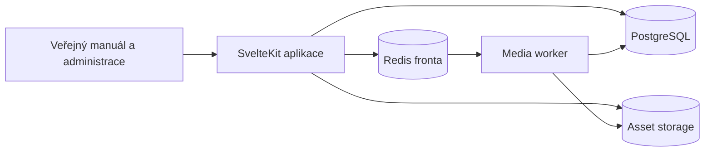

# Brandywine — cesta k profesionálnímu brand operating systému

## Rozhodnutí o provozu

Brandywine má zůstat plnohodnotná serverová aplikace. Čistý serverless dnes není
dobrý výchozí směr: velké uploady, FFmpeg, Ghostscript, Inkscape, vlastní fonty,
PDF a dávkové ZIP exporty potřebují dlouhé procesy, lokální pracovní prostor a
předvídatelný výkon.

Oficiální model mají tvořit dvě rovnocenné varianty:

1. **Brandywine Cloud** — spravovaná služba bez instalace pro zákazníka.
2. **Brandywine Self-hosted** — jeden produkční Docker balíček pro běžný Linux
   server. Uživatel nastaví doménu a dvě hesla, spustí jeden příkaz a zbytek
   dokončí ve webovém průvodci.

Obě varianty mají používat stejnou aplikaci. Není žádoucí udržovat „osekanou“
serverless edici.

V první etapě může být storage společný Docker volume. Rozhraní pro S3/R2 se má
doplnit před horizontálním škálováním nebo managed cloudem. Tím se později
oddělí aplikace od konkrétního serveru bez přepisu DAMu.

## Co už projekt dobře pokrývá

- veřejný brand manuál s hierarchií stránek a editorem bloků;
- brand identita, světlé/tmavé motivy, barvy, palety a gradienty;
- typografie, font files, textové styly a design-token endpoint;
- asset manager se složkami, tagy, náhledy a konverzemi;
- PostgreSQL migrace, Redis fronty a samostatný media worker;
- administrátoři, editoři, členové, sessions, hesla a magic links;
- české a anglické administrační rozhraní;
- rozumný základ pro Docker self-hosting.

## Kritické produktové mezery z auditu

### P0 — spolehlivost a bezpečnost

- dokončit všechny režimy přístupu end-to-end, zejména token links;
- oddělit draft od publikované verze manuálu a zavést atomické publikování;
- audit log změn, autor změny, historie a možnost návratu;
- automatické zálohy databáze i assetů, obnova z administrace a pravidelný
  test obnovy;
- monitoring zdraví aplikace, workeru, front, disku a poslední zálohy;
- antivirová kontrola uploadů, limity a bezpečná obsluha SVG/PDF;
- rate limiting loginu, resetu hesla, magic links a veřejných share links;
- transakční práce s uploadem: stav `processing / ready / failed`, retry a
  viditelná chyba místo tichého selhání fronty;
- integrační testy pro role, chráněný manuál, upload → náhled → download a
  migrace ze starší verze.

### P1 — manuál, který lze skutečně publikovat

- rozšířit napojené bloky galerie, carousel, ikony, asset gallery a download o
  ruční kurátorství, řazení, limity, renditions a ovládání carouselu;
- per-language obsah stránek a bloků, fallbacky, překladový workflow a přehled
  nepřeloženého obsahu; současný model má jeden obsah a jen jazykové nastavení;
- draft/publish, plánované publikování, preview link a porovnání změn;
- globální fulltext přes názvy, text bloků i asset metadata včetně „zero-result“
  analytiky;
- reusable blocks/snippets, globální navigace a šablony sekcí;
- validace kvality před publikováním: chybějící alt texty, rozbitá URL,
  nepřístupný kontrast, prázdné bloky a nepřeložený obsah;
- SEO a sdílení: canonical URL, sitemap, Open Graph, vlastní favicon a metadata
  pro každou stránku;
- export celého manuálu do PDF a offline balíčku;
- responzivní preview desktop/tablet/mobile přímo v editoru.

### P1 — profesionální DAM

- kolekce napříč složkami a veřejné collection pages;
- skutečné hromadné operace: tagování, přesun, změna stavu, ZIP a mazání se
  souhrnem chyb;
- verzování assetů s current version, changelogem, porovnáním a rollbackem;
- share links pro asset, kolekci i složku: expirace, heslo, omezení downloadu a
  možnost okamžitého zrušení;
- rozšířená metadata: autor, copyright, licence, expirace, rozměry, DPI, profil,
  IPTC/XMP/EXIF;
- lifecycle `draft / approved / deprecated / expired` a náhrada starého assetu;
- duplicate review místo pouhé chyby: použít existující, vytvořit novou verzi,
  nebo nahrát záměrně;
- smart filtry, uložené pohledy, masonry/list/grid a stránkování bez limitu 200;
- ZIP export na pozadí s progressem a dočasným odkazem;
- předvolby renditions pro web, social, tisk a Office.

### P2 — governance a spolupráce

- UI pro týmy a resource permissions, které už datový model částečně zná;
- komentáře a zmínky u stránky, bloku a assetu;
- approval workflow s vlastníkem, reviewerem a termínem;
- notifikace v aplikaci a e-mailem;
- přehled „co se změnilo od minulé návštěvy“;
- ownership sekcí a pravidelná revize zastaralého obsahu;
- dashboard kvality brand systému a completeness score s konkrétními úkoly.

### P2 — API a integrace

- verzované REST API, API tokens se scopes, rotace a audit použití;
- webhooks s podpisem, retry a dead-letter přehledem;
- W3C Design Tokens export pro barvy, typografii, spacing, radius, shadow a
  motion včetně aliasů a themes;
- Figma/Token Studio read sync jako první integrace;
- exporty ASE/GPL/CSS/SCSS/Tailwind/Android/iOS;
- embed widget a CDN URL pro schválené assety;
- později SSO přes OIDC/SAML a SCIM pro větší organizace.

## Self-hosting ve stylu WordPressu

Základ této zkušenosti je už implementovaný v root CLI `./brandywine`: instalace,
diagnostika, lokální backup/restore, update a ovládání služeb. Následující body
popisují cestu od funkčního self-hostingu k distribuovanému produktu pro běžné
správce serverů.

### Instalační zkušenost

1. uživatel stáhne release nebo spustí jeden instalační příkaz;
2. instalátor ověří Docker, porty, DNS, volné místo a paměť;
3. vygeneruje secrets a připraví `.env` bez ručního kopírování;
4. spustí produkční stack a čeká na health checks;
5. otevře `/admin/setup`, kde se nastaví účet, značka, e-mail a zálohy;
6. administrace ukáže verzi, stav služeb a dostupnou aktualizaci.

### Provozní minimum pro veřejný release

- doplnit k hotovým příkazům `install`, `update`, `backup`, `restore` a `doctor`
  také bezpečný `uninstall` a migrační průvodce;
- podepsané/verzované image místo povinného buildu na cílovém serveru;
- automatické DB migrace s pre-migration backupem;
- update kanály stable/beta, release notes a rollback na předchozí image;
- denní šifrovaná záloha mimo server a retenční politika;
- dashboard kapacity: databáze, uploady, fronta a zbývající disk;
- dokumentovaný přesun instance na jiný server;
- demo obsah a onboarding checklist po první instalaci.

## Doporučené pořadí realizace

### Milestone A — Release foundation

- odstranit P0 chyby a úniky citlivých dat;
- dokončit testovací matici rolí, access modes a asset pipeline;
- spolehlivý produkční Compose, health checks, backup/restore a update postup;
- stavové zpracování médií a viditelné retry.

**Výstup:** bezpečně nasaditelná single-brand verze, kterou lze provozovat bez
každodenního zásahu vývojáře.

### Milestone B — Publishable manual

- draft/publish a historie;
- dokončené dynamické bloky;
- skutečný vícejazyčný obsah;
- quality gate, vyhledávání, SEO a PDF export.

**Výstup:** náhrada statického brand PDF a běžného CMS.

### Milestone C — DAM workflows

- collections, versions, share links, bulk ZIP, metadata a lifecycle;
- background jobs s progressem;
- S3-compatible storage adapter.

**Výstup:** náhrada sdílené složky a základního DAMu.

### Milestone D — Brand operations

- komentáře, approvals, audit, notifications a analytics;
- veřejné API, webhooks a token integrations;
- Figma/Token Studio integrace.

**Výstup:** brand operating system pro agentury a interní brand týmy.

## Produktová zásada

Nová položka v UI se považuje za hotovou pouze tehdy, když má oprávnění,
validaci, chybové stavy, audit, test, migraci, mobilní stav a provozní diagnostiku.
Datová tabulka nebo neaktivní ovládací prvek není dokončená funkce.
