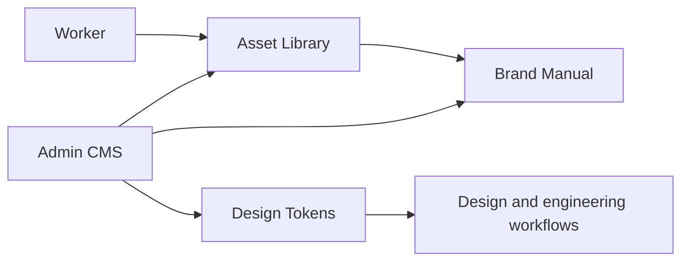

<p align="center">
  
</p>

<h1 align="center">Brandywine</h1>

<p align="center">
  <strong>The open-source brand operating system for design teams.</strong><br />
  Build living brand manuals, manage approved assets, document design tokens, and keep every designer, marketer, and partner aligned.
</p>

<p align="center">
  <a href="#quick-start"><strong>Quick start</strong></a>
  ·
  <a href="#what-you-get"><strong>Features</strong></a>
  ·
  <a href="#built-for"><strong>Who it is for</strong></a>
  ·
  <a href="#stack"><strong>Stack</strong></a>
</p>

<p align="center">
  
  
  
</p>

---

## One source of truth for every brand decision

Brand guidelines should not live in a static PDF, a forgotten Figma page, and a folder called `final-final-v7`.

Brandywine gives teams a self-hosted CMS for modern brand systems: a polished public manual for readers, a focused admin interface for maintainers, and a structured asset library for everything designers actually need to ship consistent work.

It is made for brandguide workflows where details matter: colors, contrast, typography, file formats, logo usage, downloads, permissions, page hierarchy, and multilingual publishing.

## What you get

### A living brand manual

Create a public-facing manual that feels like a real product, not a document dump.

- Custom brand identity, logo, primary color, footer, and access rules
- Manual pages with hierarchy, slugs, sorting, and editable content blocks
- Dedicated sections for colors, typography, logos, and brand assets
- Czech and English system UI with a configurable default manual language
- Public, password-protected, and e-mail allowlisted manuals

### Color governance designers can trust

Treat brand colors as production data, not screenshots.

- Palettes, gradients, shades, contrast checks, and copy-friendly values
- Exportable color formats for design and engineering workflows
- Token endpoint for downstream usage
- Pantone naming preferences and practical UI controls for maintainers

### Typography that understands brand systems

Document type families, files, styles, weights, OpenType features, glyph coverage, and usage constraints.

- Font upload and managed font files
- Type styles for light, dark, and universal usage
- Allowed text colors per style, with contrast checks against white and black
- Glyph browsing with weight controls
- OpenType feature previews, including discretionary ligatures

### Asset management without the chaos

Keep files organized in the same structure the manual uses.

- Upload, preview, search, tag, download, rename, move, and delete assets
- Hierarchical folders with breadcrumbs, rename/delete flows, and resizable navigation
- Shared folder picker component for future manual page builders and user workflows
- Image, document, font, SVG, PDF, and video processing pipeline
- Background worker for thumbnails, conversions, and media optimization

### Admin UX made for repeated work

Brandywine is built as a working tool for designers and brand managers, not a settings graveyard.

- Dense, scannable admin UI
- Responsive layouts for real-world maintenance
- Clear destructive actions and inline editing patterns
- Theme-aware previews for light and dark brand usage
- Self-hosted data ownership from the first deploy

## Built for

Brandywine is designed for teams that care about brand consistency but do not want to buy into a closed, expensive, one-size-fits-all platform.

- Design studios maintaining brand systems for clients
- In-house brand teams publishing guidelines for the whole company
- Marketing teams distributing approved logos, images, and templates
- Product teams aligning designers and engineers on tokens and typography
- Agencies that need a repeatable brand manual stack they can self-host

## Why Brandywine

| Static brand PDF | Generic DAM | Brandywine |
| --- | --- | --- |
| Hard to update | Stores files, not rules | Manual, assets, and rules in one place |
| Usually outdated | Weak design context | Built around colors, type, logos, and usage |
| No permissions model | Often closed SaaS | Self-hosted and open-source |
| No tokens or exports | Not made for designers | Structured brand data for real workflows |
| Poor mobile/admin UX | Heavy enterprise UI | Focused CMS experience |

## Product shape



## Quick start

```bash
./brandywine install brand.example.com
```

The installer creates `.env` with cryptographically random secrets, validates
Docker and Compose, builds the application, runs database migrations, waits for
PostgreSQL and Redis, and reports when the application is ready. Use `localhost`
instead of a domain for a local installation.

The production stack is the default: application, compiled media worker,
PostgreSQL, Redis and Caddy start together, migrations run automatically, and
services restart after a reboot. Development is opt-in:

```bash
docker compose -f docker-compose.yml -f compose.dev.yml up --build
```

When ports 80 or 443 are already occupied locally, set `HTTP_PORT=8080`,
`HTTPS_PORT=8443`, `APP_URL=http://localhost:8080`, and
`CADDYFILE=./Caddyfile.local` in `.env`. The local Caddy configuration serves
HTTP without requiring a locally trusted certificate; production keeps HTTPS
and automatic redirects.

Open the manual and admin:

```text
https://brand.example.com/
https://brand.example.com/admin
```

On a fresh install, Brandywine will guide you through creating the first admin account.

### Operations

The same utility covers routine self-hosting without knowledge of Docker internals:

```bash
./brandywine doctor
./brandywine backup
./brandywine update
./brandywine restore backups/20260821T120000Z
./brandywine logs
```

Backups contain a PostgreSQL custom-format dump, all uploaded files, a manifest,
and SHA-256 checksums. Restore first creates an automatic safety backup and
requires explicit confirmation. Keep the `backups/` directory outside the server
or copy it to separate storage for disaster recovery.

## Development

```bash
docker compose -f docker-compose.yml -f compose.dev.yml up -d db redis
cd app
npm install
npm run db:migrate
npm run dev
```

The [contributing guide](./CONTRIBUTING.md) covers the full setup, checks and
pull requests; [docs/architecture.md](./docs/architecture.md) explains how the
code is organised.

## Extending

Brandywine is built from registries, so most extensions are new folders rather
than edits to existing code:

- **Manual blocks** — a folder in `app/src/lib/blocks/` with a definition, a
  public view and an editor. [Guide](./docs/extending/blocks.md)
- **Admin modules** — a sidebar entry and access rule in
  `app/src/lib/modules/` plus pages in `app/src/routes/admin/`.
  [Guide](./docs/extending/modules.md)
- **Worker queues** — background media processing.
  [Guide](./docs/extending/worker.md)
- **Languages** — translations for the admin and the public manual.
  [Guide](./docs/extending/languages.md)
- **Plugins** — blocks, admin sections, API routes and event handlers in the
  installation's `plugins/` folder, without touching the code; **webhooks**
  notify other services of changes. [Guide](./docs/extending/plugins.md)
- **Runtime plugins** — a zip uploaded in Admin → Plugins that works at once,
  without a rebuild: blocks with generated editors, admin pages, API and
  events. [Guide](./docs/extending/runtime-plugins.md)

## Stack

- **Application**: SvelteKit, Svelte 5, TypeScript
- **Database**: PostgreSQL 16, Drizzle ORM
- **Queue**: Redis, BullMQ
- **Media worker**: Sharp, FFmpeg, SVGO, Ghostscript
- **Internationalization**: Paraglide.js, Czech and English included
- **Deployment**: Docker Compose, Caddy, automatic HTTPS-ready reverse proxy

## Project status

Brandywine is under active development. The core product direction is clear: a beautiful, self-hosted brand CMS for designers, brand teams, and agencies. Expect rapid iteration around manual page building, asset workflows, typography, permissions, and polish.

See the [roadmap](./docs/ROADMAP.md) (in Czech) for the release milestones, DAM
workflows, governance, integrations, and the next steps beyond the included
install/update/backup experience.

## Contributing

Contributions are welcome — read the [contributing guide](./CONTRIBUTING.md)
and the [code of conduct](./CODE_OF_CONDUCT.md). Report security issues as
described in [SECURITY.md](./SECURITY.md).

## License

Brandywine is open-source under the [Apache License 2.0](./LICENSE).

---

<p align="center">
  <strong>Build the brand manual people actually want to use.</strong>
</p>
