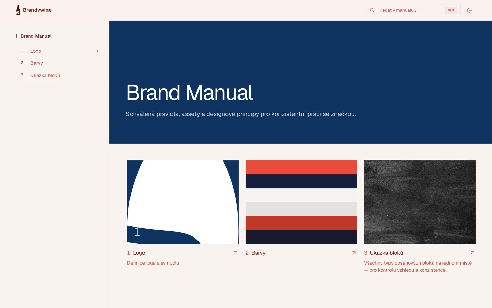
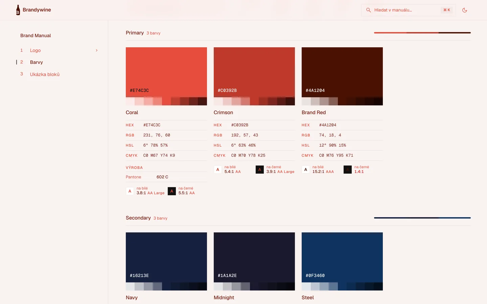
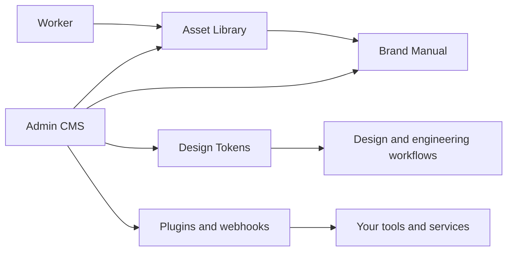

<p align="center">
  
</p>

<h1 align="center">Brandywine</h1>

<p align="center">
  <strong>The open-source brand operating system for design teams.</strong><br />
  Build living brand manuals, manage approved assets, document design tokens, and keep every designer, marketer, and partner aligned.
</p>

<p align="center">
  <a href="#quick-start"><strong>Quick start</strong></a>
  ·
  <a href="#what-you-get"><strong>Features</strong></a>
  ·
  <a href="#extending"><strong>Extending</strong></a>
  ·
  <a href="./docs/README.md"><strong>Docs</strong></a>
  ·
  <a href="./CONTRIBUTING.md"><strong>Contributing</strong></a>
</p>

<p align="center">
  <a href="https://github.com/yaneczech/Brandywine/actions/workflows/ci.yml"></a>
  
  
  
</p>

<p align="center">
  
</p>

---

## One source of truth for every brand decision

Brand guidelines should not live in a static PDF, a forgotten Figma page, and a folder called `final-final-v7`.

Brandywine gives teams a self-hosted CMS for modern brand systems: a polished public manual for readers, a focused admin interface for maintainers, and a structured asset library for everything designers actually need to ship consistent work.

It is made for brandguide workflows where details matter: colors, contrast, typography, file formats, logo usage, downloads, permissions, page hierarchy, and multilingual publishing.

## What you get

### A living brand manual

Create a public-facing manual that feels like a real product, not a document dump.

- Pages in a tree with 35 content block types: rich text, images and galleries,
  before/after, hotspots, colours, typography, logo specification and downloads,
  do & don't, grids, charts, tables, embeds and more
- Your brand's look: accent colour, light/dark/visitor-selectable theme,
  typography presets, brand fonts for headings and text, corner radius
- Chapter numbering, table of contents, search, card covers generated from the
  content, subpages before or after the page content
- Public, password-protected and e-mail-allowlisted manuals
- A manual audit that finds empty blocks, missing alt text, broken files and
  unreadable colour combinations before you share
- Markdown export, `llms.txt` and a read-only MCP server, so AI tools follow
  your brand rules
- Czech and English interface; the manual language is set per brand

### Color governance designers can trust

Treat brand colors as production data, not screenshots.

- Palettes, gradients, shades, contrast checks, and copy-friendly values
- Exportable color formats for design and engineering workflows
- Token endpoint for downstream usage
- Pantone naming preferences and practical UI controls for maintainers

<p align="center">
  
</p>

### Typography that understands brand systems

Document type families, files, styles, weights, OpenType features, glyph coverage, and usage constraints.

- Font upload and managed font files
- Type styles for light, dark, and universal usage
- Allowed text colors per style, with contrast checks against white and black
- Glyph browsing with weight controls
- OpenType feature previews, including discretionary ligatures

### Asset management without the chaos

Keep files organized in the same structure the manual uses.

- Upload, preview, search, tag, download, rename, move, and delete assets
- Hierarchical folders with breadcrumbs, rename/delete flows, and resizable navigation
- Image, document, font, SVG, PDF, and video processing pipeline
- Background worker for thumbnails, conversions, and media optimization

### Admin UX made for repeated work

Brandywine is built as a working tool for designers and brand managers, not a settings graveyard.

- Dense, scannable admin UI
- Responsive layouts for real-world maintenance
- Clear destructive actions and inline editing patterns
- Theme-aware previews for light and dark brand usage
- Self-hosted data ownership from the first deploy

## Built for

Brandywine is designed for teams that care about brand consistency but do not want to buy into a closed, expensive, one-size-fits-all platform.

- Design studios maintaining brand systems for clients
- In-house brand teams publishing guidelines for the whole company
- Marketing teams distributing approved logos, images, and templates
- Product teams aligning designers and engineers on tokens and typography
- Agencies that need a repeatable brand manual stack they can self-host

## Why Brandywine

| Static brand PDF | Generic DAM | Brandywine |
| --- | --- | --- |
| Hard to update | Stores files, not rules | Manual, assets, and rules in one place |
| Usually outdated | Weak design context | Built around colors, type, logos, and usage |
| No permissions model | Often closed SaaS | Self-hosted and open-source |
| No tokens or exports | Not made for designers | Structured brand data for real workflows |
| Poor mobile/admin UX | Heavy enterprise UI | Focused CMS experience |

## Product shape



## Quick start

On a Linux server or a Mac with Docker:

```bash
curl -fsSL https://raw.githubusercontent.com/yaneczech/Brandywine/main/install.sh | sh
```

The installer checks the computer, asks whether Brandywine should run on a
domain (with automatic HTTPS) or only locally, optionally sets up e-mail, and
starts everything. Then open the printed address: a short wizard creates your
account, sets up your brand and can fill the manual with an example in your
colours.

Backups, updates, health checks and uninstalling are one command each:

```bash
./brandywine backup
./brandywine update
./brandywine doctor
```

The [installation guide](./docs/INSTALL.md) covers the options, non-interactive
installs, operations and troubleshooting.

## Development

```bash
docker compose -f docker-compose.yml -f compose.dev.yml up -d db redis
cd app
npm install
npm run db:migrate
npm run dev
```

The [contributing guide](./CONTRIBUTING.md) covers the full setup, checks and
pull requests; [docs/architecture.md](./docs/architecture.md) explains how the
code is organised.

## Extending

Brandywine is built from registries, so most extensions are new folders rather
than edits to existing code:

- **Manual blocks** — a folder in `app/src/lib/blocks/` with a definition, a
  public view and an editor. [Guide](./docs/extending/blocks.md)
- **Admin modules** — a sidebar entry and access rule in
  `app/src/lib/modules/` plus pages in `app/src/routes/admin/`.
  [Guide](./docs/extending/modules.md)
- **Worker queues** — background media processing.
  [Guide](./docs/extending/worker.md)
- **Languages** — translations for the admin and the public manual.
  [Guide](./docs/extending/languages.md)
- **Plugins** — blocks, admin sections, API routes and event handlers in the
  installation's `plugins/` folder, without touching the code; **webhooks**
  notify other services of changes. [Guide](./docs/extending/plugins.md)
- **Runtime plugins** — a zip uploaded in Admin → Plugins that works at once,
  without a rebuild: blocks with generated editors, admin pages, API and
  events. [Guide](./docs/extending/runtime-plugins.md)

## Stack

- **Application**: SvelteKit, Svelte 5, TypeScript
- **Database**: PostgreSQL 16, Drizzle ORM
- **Queue**: Redis, BullMQ
- **Media worker**: Sharp, FFmpeg, SVGO, Ghostscript
- **Internationalization**: Paraglide.js, Czech and English included
- **Quality**: svelte-check, ESLint, Vitest, Playwright; CI on every pull request
- **Deployment**: Docker Compose, Caddy, automatic HTTPS-ready reverse proxy

## Project status

Brandywine is in active development and has not reached 1.0 yet. It is usable
for a single brand today and migrates its database automatically on update,
but the HTTP API and the plugin contract may still change between releases. See the
[roadmap](./docs/ROADMAP.md) for what comes next and the
[changelog](./CHANGELOG.md) for what changed.

## Contributing

Contributions are welcome — read the [contributing guide](./CONTRIBUTING.md)
and the [code of conduct](./CODE_OF_CONDUCT.md). Report security issues as
described in [SECURITY.md](./SECURITY.md).

## License

Brandywine is open-source under the [Apache License 2.0](./LICENSE). See
[NOTICE](./NOTICE) for attribution.

---

<p align="center">
  <strong>Build the brand manual people actually want to use.</strong>
</p>
