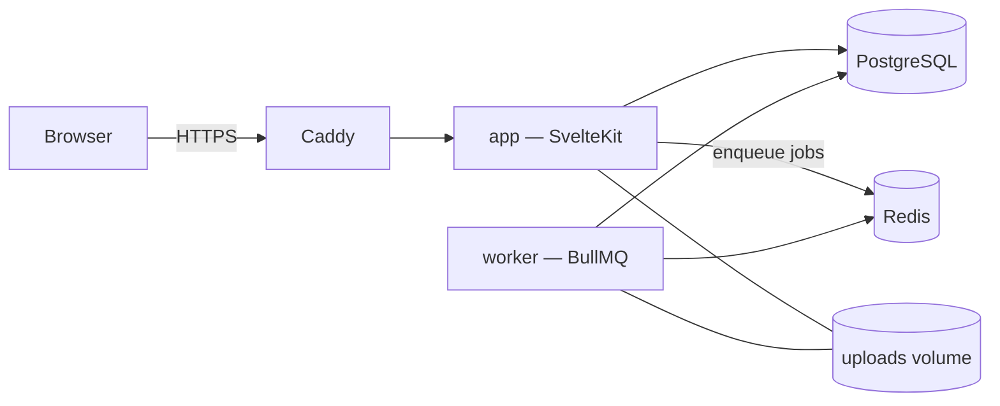

# Architecture

Brandywine is a SvelteKit application with a PostgreSQL database and a small
background worker for media processing. Everything runs from one Docker
Compose stack.



| Service | What it does |
| --- | --- |
| `app/` | Admin, public manual, HTTP API, MCP server. SvelteKit 2, Svelte 5, TypeScript, Drizzle ORM. |
| `worker/` | Thumbnails, PDF page previews, video posters, WebP/AVIF conversion, SVG clean-up, logo exports. BullMQ, Sharp, FFmpeg, Ghostscript. |
| PostgreSQL | All content and settings. |
| Redis | Job queue between the app and the worker. |
| Caddy | Reverse proxy with automatic HTTPS. |

## Repository layout

```text
app/                    SvelteKit application
  drizzle/migrations/   SQL migrations (drizzle-kit), applied on start
  scripts/              icon generator, design audit
  src/
    hooks.server.ts     session and language
    messages/           UI translations (en.json, cs.json) — Paraglide
    lib/
      blocks/           manual content blocks, one folder per block type
      modules/          admin sections (sidebar entries + access rules)
      components/       shared Svelte components (admin/, manual/, ui/)
      db/               Drizzle client and schema
      server/           server-only code: auth, permissions, export, audit…
      manual/           manual helpers shared by server and client
      auth/             client-safe role helpers
      icons/            generated Material Symbols components
      ui/, utils/, actions/
    routes/
      (manual)/         public manual: landing page and [...slug] pages
      admin/            admin, one folder per module
      api/              JSON API used by the admin
  tests/unit/           Vitest
  tests/e2e/            Playwright
worker/                 media worker (Node, BullMQ)
  src/queues.ts         the queues the worker serves
  src/processors/       one processor per job type
plugins/                installed plugins; plugins.json lists the active ones
docs/                   documentation (you are here)
brandywine              install / update / backup / restore CLI
docker-compose.yml      production stack; compose.dev.yml is the dev overlay
DESIGN.md               design codex — binding UI rules
```

## Request flow

1. `hooks.server.ts` resolves the session (`locals.user`) and the language.
   The public manual always renders in the brand's language
   (`brand_settings.default_language`); the admin follows the user's choice.
2. **Public manual** — `routes/(manual)/+layout.server.ts` enforces the access
   mode (public, password, e-mail allowlist) and loads the page tree.
   `[...slug]/+page.server.ts` loads the page, its blocks and the brand data the
   blocks need (colours, fonts, assets). `BlockRenderer` renders each block.
3. **Admin** — `routes/admin/+layout.server.ts` requires at least the `editor`
   role and the role each module declares. Pages talk to `routes/api/**`.
4. **Uploads** are stored under `UPLOAD_DIR` and served by `routes/uploads`.
   The API enqueues processing jobs (`lib/server/queue.ts`); the worker writes
   results (thumbnails, conversions) back to the asset row.

## Extension points

Brandywine is built around registries, so most extensions add files instead of
editing existing ones.

| You want to… | Add | Guide |
| --- | --- | --- |
| a new kind of manual content | `app/src/lib/blocks/<type>/` | [Blocks](extending/blocks.md) |
| a new admin section | `app/src/lib/modules/<id>/` + `app/src/routes/admin/<id>/` | [Modules](extending/modules.md) |
| background processing | `worker/src/processors/` + an entry in `worker/src/queues.ts` | [Worker queues](extending/worker.md) |
| a UI language | `app/src/messages/<lang>.json` + manual strings | [Languages](extending/languages.md) |
| any of the above without touching the code, or event handlers | a folder in `plugins/` | [Plugins](extending/plugins.md) |
| notify another service when something changes | Admin → Settings → Webhooks | [Webhooks](extending/plugins.md#webhooks) |

## Events

After a change is saved, the API calls `emit()` (`app/src/lib/server/events.ts`)
with a typed event from `app/src/lib/events.ts` — `asset.uploaded`,
`page.saved`, `user.signedIn`… Active plugins' handlers and matching webhooks
receive it asynchronously; a failing handler or webhook never fails the
request. New features that change content should emit an event too.

## Data model

The schema lives in `app/src/lib/db/schema/`, one file per area:

| File | Tables |
| --- | --- |
| `brand.ts` | `brand_settings` — single row: identity, manual appearance, access mode, languages |
| `sections.ts` | `manual_pages` (tree via `parent_id`), `manual_blocks` (`type` + JSON `config`) |
| `colors.ts` | colours, palettes, gradients |
| `typography.ts` | fonts, font files, text styles |
| `assets.ts` | assets, asset versions and folders |
| `users.ts`, `teams.ts` | users, sessions, teams, team members, permissions and invitations |
| `shareLinks.ts`, `analytics.ts` | share links, usage events |
| `webhooks.ts` | outgoing webhooks |

A block's `config` is free-form JSON owned by its block type; the database
only stores it. Schema changes need a migration:

```bash
cd app
npm run db:generate   # writes drizzle/migrations/NNNN_*.sql from the schema
npm run db:migrate    # applies it locally; production applies it on start
```

## Roles and permissions

`member` < `editor` < `admin` (`$lib/auth/roles`). Editors manage brand
content, admins also manage users and settings, members only read the manual
and download assets. Team permissions (`lib/server/permissions.ts`) narrow what
members can read. Check permissions on the server — in `+page.server.ts` loads
and API handlers — never only in the UI.

## Conventions

- TypeScript everywhere; Svelte 5 runes (`$state`, `$derived`, `$props`).
- UI copy goes through `src/messages/*.json` (`m.key()`); no hard-coded strings.
- Styles follow [DESIGN.md](../DESIGN.md) and use the tokens in
  `app/src/styles/global.css`; icons come from `$lib/icons` only.
- Comments explain *why*; code and comments are in English.
